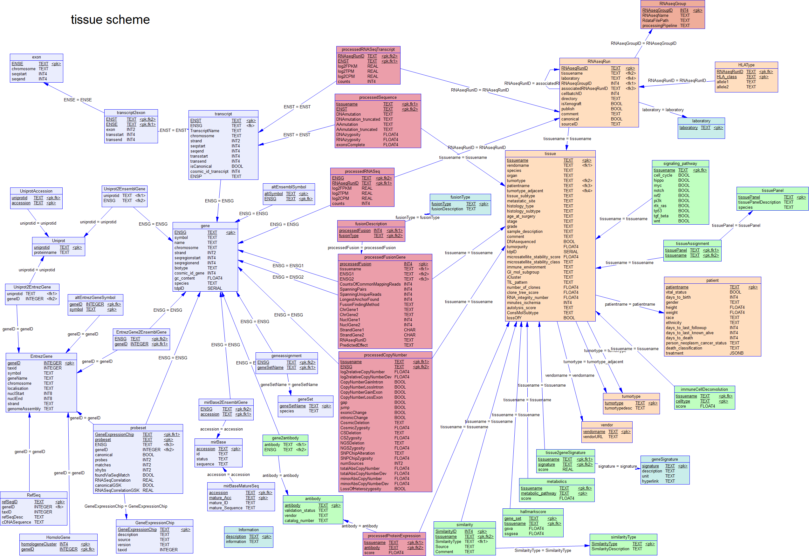

# GeneInfo2db

GeneInfo2db is an R package for the creation of a PostgreSQL relational database for CLIFF and TIFF.

The current version loads data from [DepMap 24Q4](https://figshare.com/articles/dataset/DepMap_24Q4_Public/27993248).

This package fills the database with tissue and cell line data as well as annotation data 
from genes and proteins.

### Cell line database structure

### Tissue database structure

> [!IMPORTANT]
> Data are stored in 3 different schemas: cellline, tissue and public. 
> Public contains all purple tables. To show relational dependencies
> the graphs above contains cellline + public tables and tissue + public 
> tables, respectively.
