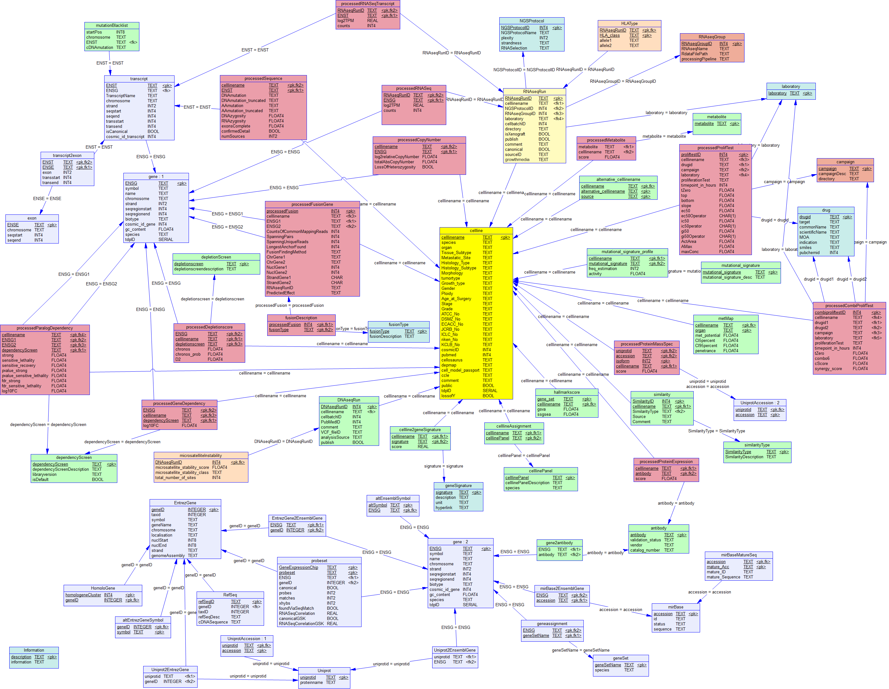

# GeneInfo2db

GeneInfo2db is an R package for the creation of a PostgreSQL relational database for CLIFF and TIFF.

Ready to create data from DepMap 24Q2, now.

This package fills the database with tissues and cell lines.

|[tissueDB](data-raw/DB_structure/tissueDB.png)
